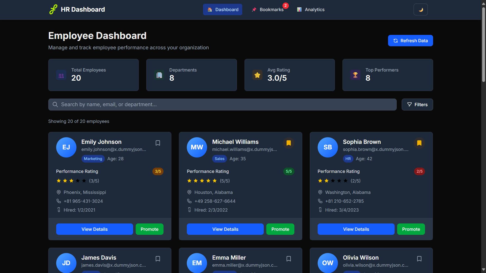
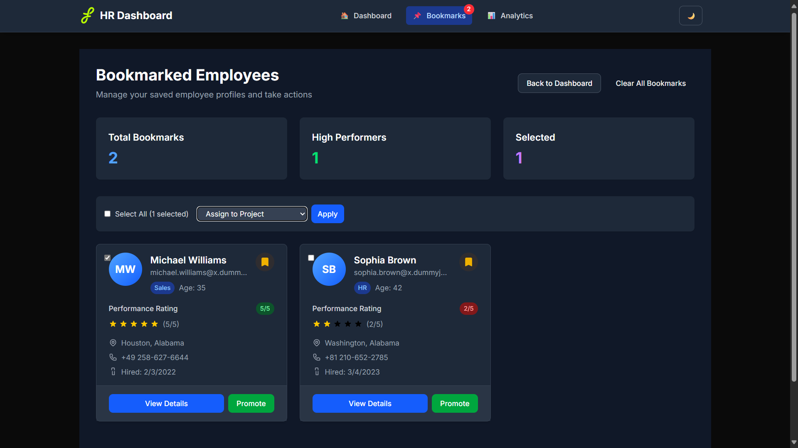
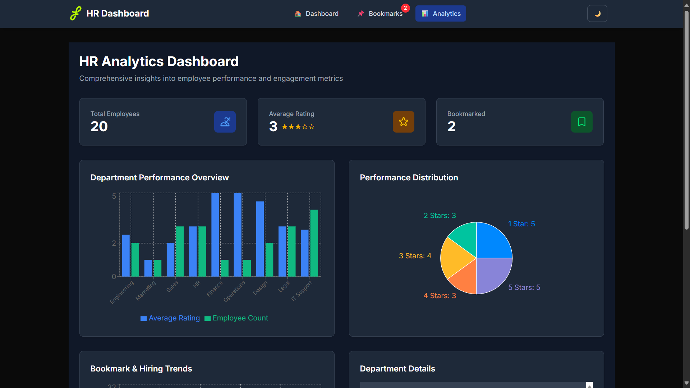
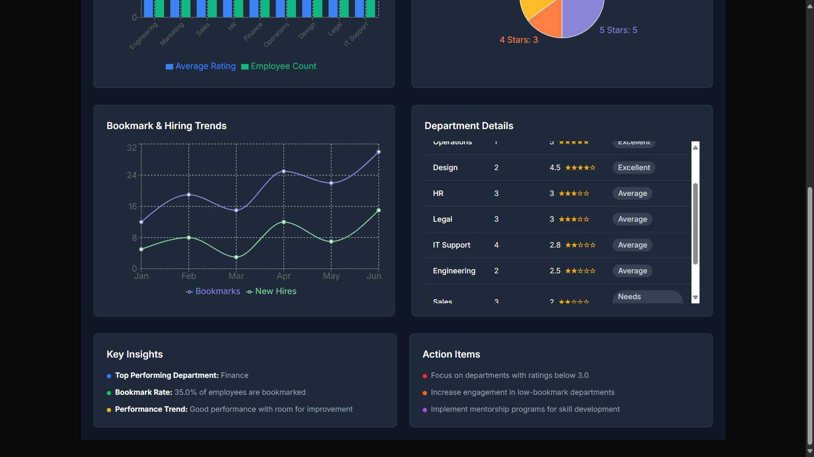

# Flam-HR-Dashboard
This repository contains a HR-Dashboard created for Flam Frontend Intern role assignment.

Link: https://hr-dashboard-flam.vercel.app/

## Setup Instructions

```
git clone https://github.com/scoder17/HR-Dashboard.git
cd HR-Dashboard
npm i
npm run dev
```

## Features Implemented

### Dashboard Home

- **Total employees, departments, avg. rating and top performers count**

- **Search Bar**

You can search by name, email or department.

- **Filters**

You can filter using department and ratings.

- **Employee Cards**

Detail about all employee can be seen, you can bookmark, promote or view details about the employee.

### Bookmarks page

- **Total Bookmarks, high performers and selected count**

- **Employee Cards**

Once bookmarked from Homepage, you can see bookmarked employees here. You can select employees and based on that you can promote, assign tasks or remove from bookmarks in bulk.

### Analytics page

- **Total Employees, avg. rating and total bookmarks count**

- **Charts related to employees**

    - Department Performance Overview, Avg. rating and employee count in bar chart
    
    - Pie chart showing ratings count

    - Line chart showing bookmark count and hired counts in a particular month

    - Overall department details performance sorted basis on avg. rating

## Screenshots

### Home page


### Bookmarks page


### Analytics page

